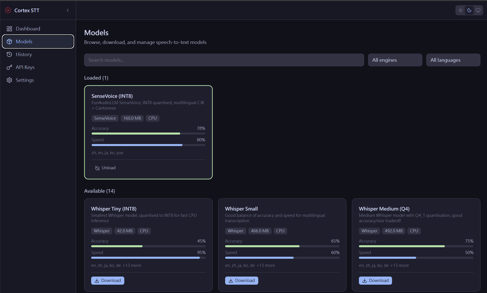
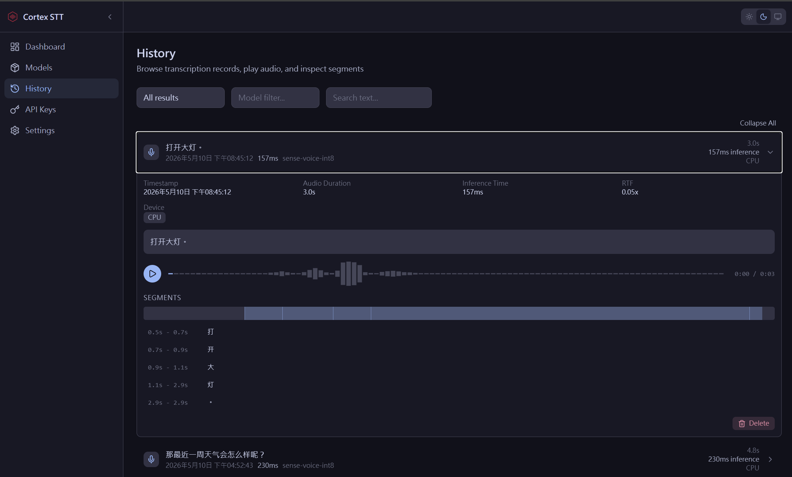

# Cortex STT Server

Home Assistant app providing multi-engine speech-to-text with Whisper, Parakeet, SenseVoice, and more.

## Screenshots

**Models** — browse and download speech-to-text models.

**History** — inspect transcription history with audio playback and per-segment timing.

## Installation

Click the button above, or manually: **Settings → Apps → App Store → ⋮ → Repositories → Add `https://github.com/hass-cortex/repository`**. After the repository loads, install **Cortex STT** from the list.

## Acknowledgements

Built on top of [transcribe-rs](https://github.com/cjpais/transcribe-rs) — a unified Rust library providing the multi-engine inference layer.

## License

MIT — see [LICENSE.md](LICENSE.md).
