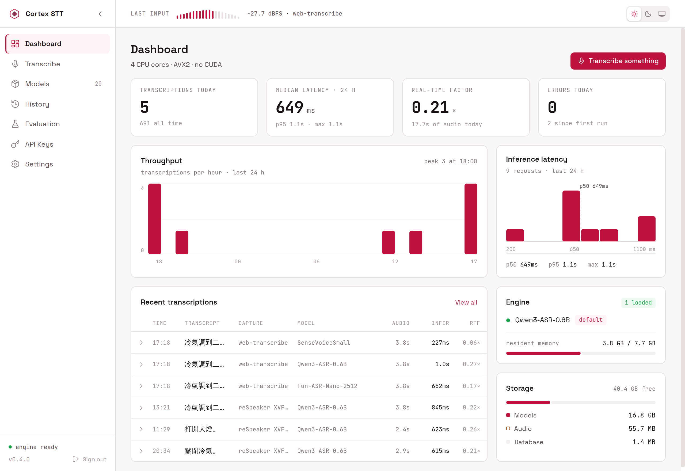
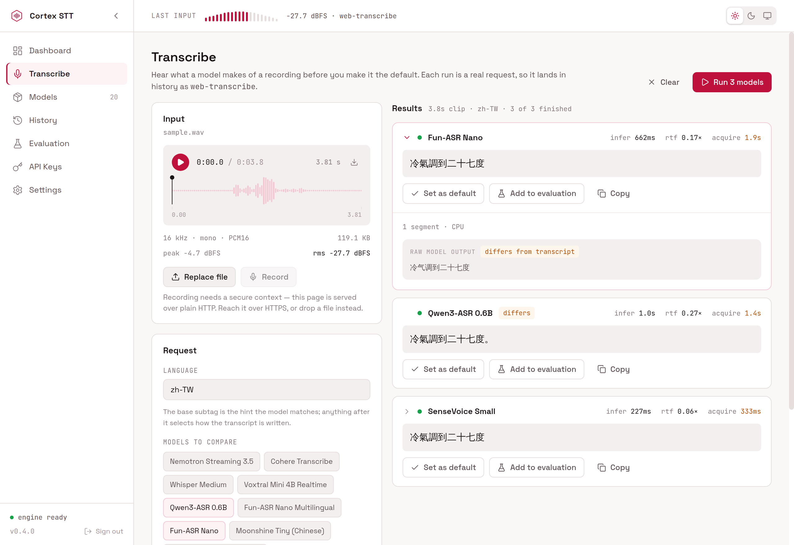
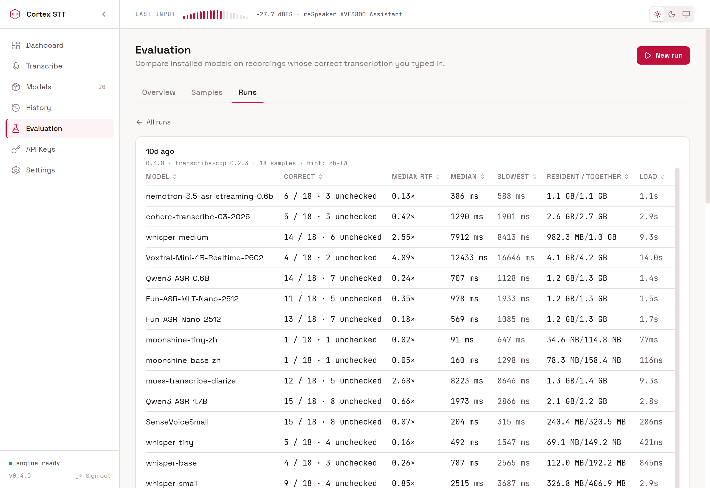
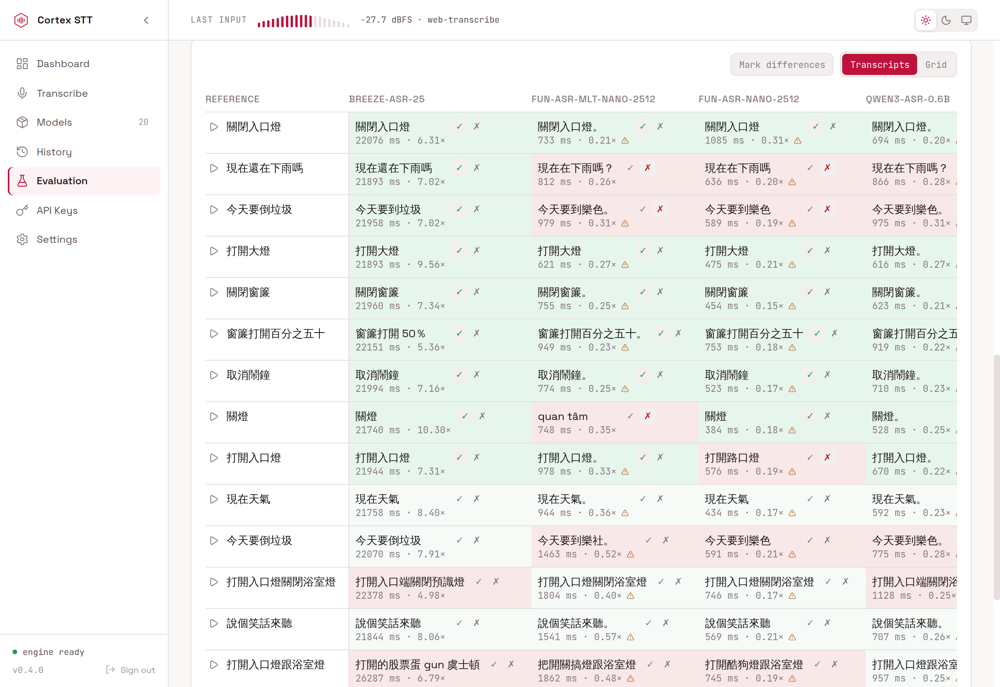
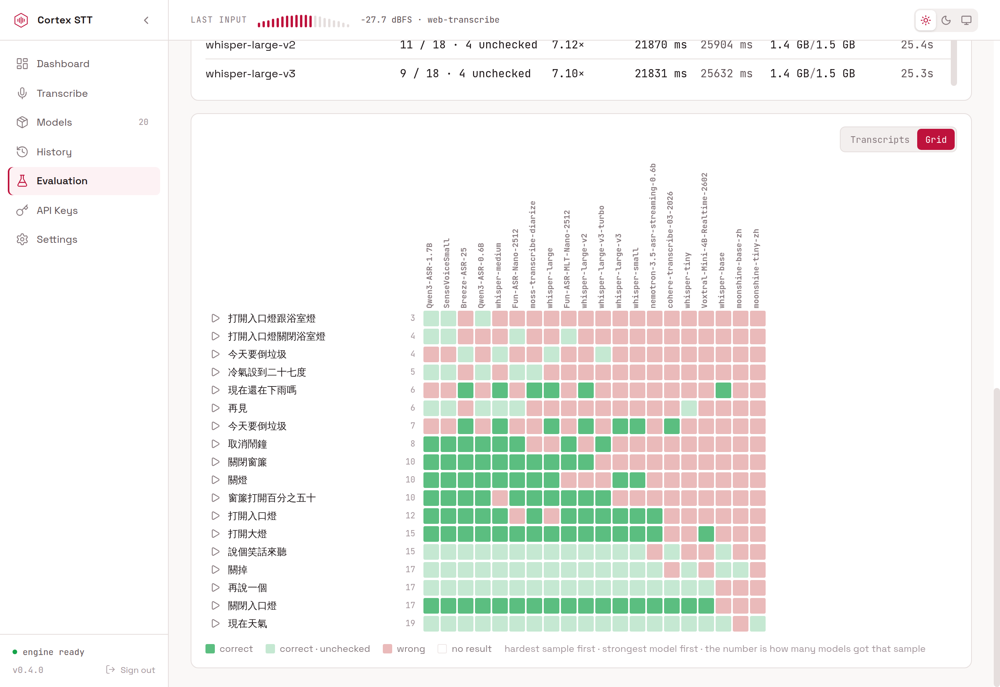

# Cortex STT Server

Home Assistant app providing multi-model speech-to-text — Whisper, Parakeet, SenseVoice, Qwen3-ASR, and more on a single [transcribe.cpp](https://github.com/handy-computer/transcribe.cpp) (GGUF) runtime. See the [transcribe.cpp supported-models table](https://github.com/handy-computer/transcribe.cpp#supported-models) and its per-model cards under [`docs/models/`](https://github.com/handy-computer/transcribe.cpp/tree/main/docs/models) for the full list of built-in models.

## Features

- **Runs on your hardware** — no cloud, no API key, no per-minute bill.
- **Every model family on one runtime** — Whisper, Parakeet, SenseVoice,
  Qwen3-ASR and more as GGUF on a single transcribe.cpp engine.
- **One STT entity per downloaded model**, so a pipeline can pick the right
  one per language or per use case.
- **WebSocket streaming** — audio reaches the server while you are still
  speaking, so decoding overlaps capture.
- **Measure before you choose** — run one recording through up to three models
  side by side, and score candidates against transcripts you typed yourself.
- **Discovered by Home Assistant** through the Supervisor, so the companion
  integration needs no URL or key typed in.

## Screenshots

**Dashboard** — throughput, latency and real-time factor measured on this
machine over the last 24 hours.

**Transcribe** — run one recording through up to three models and compare
what each returned, and how long it took.

**Models** — the catalog plus what is on disk, with the p50 and run count
measured from this deployment's own history.

**History** — every transcription, with its audio, waveform and timings;
select rows to delete a batch of them.

**Evaluation** — score candidate models against hand-typed references:
accuracy you judged, inference time, real-time factor, memory and load time.

The same run two other ways — every output beside the reference it was
scored against…

…and as a grid, hardest sample first and strongest model first, where the
number is how many models got that sample right.

## Installation

See [cortex-stt/DOCS.md](cortex-stt/DOCS.md) for full install, configuration, discovery, and troubleshooting instructions.

> **Heads-up for Proxmox VE / KVM users.** The pre-built binary's
> bundled ggml inference kernels require **AVX + AVX2 + FMA + F16C +
> BMI2 + SSE 4.2** (Intel Haswell 2013+ / `x86-64-v3`). PVE's default
> `qemu64` / `kvm64` / `x86-64-v2-AES` CPU types mask AVX/AVX2/FMA
> from the guest — change the HAOS VM's CPU **Type** to `host` (or
> `x86-64-v3`) and **cold-boot** the VM (reboot is not enough). The
> addon's init oneshot detects the missing flags and prints a
> readable diagnostic instead of crash-looping. Full steps in
> [DOCS.md](cortex-stt/DOCS.md#system-requirements).

## Contributing

Issues and pull requests are welcome.

- [`cortex-stt/CONTRIBUTING.md`](cortex-stt/CONTRIBUTING.md) — dev setup, the
  checks, and the PR flow.
- [`AGENTS.md`](AGENTS.md) — the module tree, cross-module guarantees and the
  API endpoint reference.
- [`cortex-stt/CONTEXT.md`](cortex-stt/CONTEXT.md) — the domain vocabulary both
  of those use.
- [`cortex-stt/docs/adr/`](cortex-stt/docs/adr) — the decisions behind the
  runtime, the vendored catalog and the evaluation store.

## Acknowledgements

- [transcribe.cpp](https://github.com/handy-computer/transcribe.cpp) — the single GGUF/ggml runtime powering every model family.
- [handy](https://github.com/cjpais/handy) — the desktop dictation app whose runtime + model catalog this project is built on.

## License

MIT — see [LICENSE.md](LICENSE.md).
